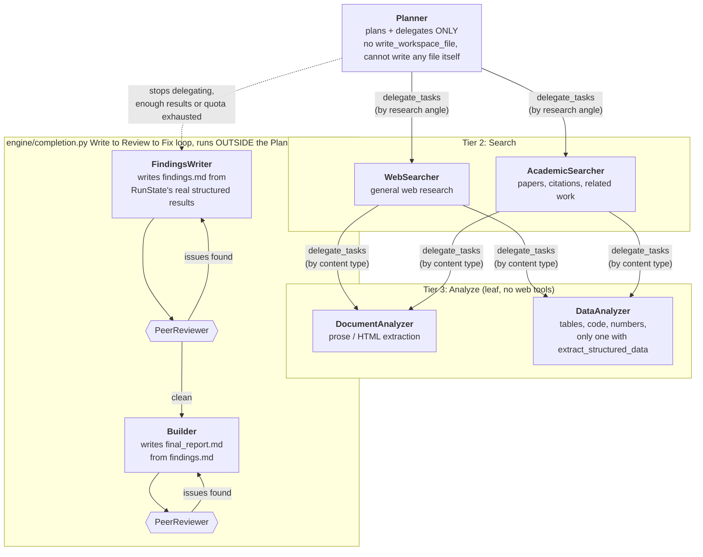

# DeepDelve

A locally-run, multi-agent deep research assistant built on the **Microsoft Agent Framework** and the **Textual** TUI library, targeting local OpenAI-compatible model servers (defaults to **Ollama**, `http://localhost:11434/v1`).

A from-scratch rebuild of an earlier prototype, not an incremental patch. The prototype worked end-to-end but was unreliable beyond simple lookups. See [`ROADMAP.md`](ROADMAP.md) for what's done, what's open, and the history of bugs found and fixed.

## Architecture



- **Planner**: plans in bounded, named slots (`background`/`comparison`/`related_work`/`verification`, never an open-ended task list), dispatches specialists, and runs an adaptive planning loop (observe results, replan if something's missing or contradictory). That is its entire job: it has no `write_workspace_file` tool at all, so it structurally cannot write `findings.md`, `final_report.md`, or anything else. Once it stops delegating (enough real results, or quota exhausted), its turn simply ends.
- **FindingsWriter**: NOT dispatched by the Planner. A Planner-tier delegate dispatched exclusively by the completion-check system, in a fresh context, once the Planner has stopped delegating (or a prior `findings.md` failed its grounding check). Writes `findings.md`, a verbatim consolidation of every dispatched task's real result, from `RunState`'s structured `{source_url, summary}` records (populated automatically by every Searcher/Analyzer dispatch, not from the Planner's own conversation, which it never sees). A fresh `PeerReviewer` dispatch then reviews the result; if flagged, FindingsWriter is re-dispatched once with the critique folded in.
- **Builder**: same pattern, one artifact later. Dispatched once `findings.md` is ready, writes/rewrites `final_report.md` from it, reviewed by a fresh `PeerReviewer` dispatch the same way.
- **WebSearcher / AcademicSearcher**: search and fetch. Specialist summaries are grounding-checked *before* they reach the Planner, not just at final-artifact time.
- **PeerReviewer**: Planner-tier delegate for an independent, fresh-context critique of `findings.md` when the FindingsWriter loop dispatches it, or of `final_report.md` when the Builder loop dispatches it (same role, different target artifact named in its task instructions). Never dispatched by the Planner itself.
- **DocumentAnalyzer / DataAnalyzer**: read/extract from downloaded files. `DataAnalyzer` also has `extract_structured_data` for tables/code/JSON blocks.

Tool access is withheld from each parent so it's structurally forced to delegate rather than short-circuit the chain; see each role's Delegation Routing block in `src/prompts.py`. FindingsWriter and Builder exist for the same reason, one level down: giving the Planner the job of writing *either* artifact meant a retry on it grew the Planner's own conversation, the context-poisoning risk this design exists to avoid (see "Context management" below). That was true for `final_report.md`/Builder from the start; it was only fixed for `findings.md`/FindingsWriter on 2026-07-14, after a live benchmark run hit 4 consecutive `findings_ungrounded` retries and exhausted its budget with nothing ever written.

## Context management

The Planner's own conversation only ever grows across a run (no compaction/pruning exists in the underlying agent-framework session). Every completion-check retry historically meant appending another nudge message and re-showing the model its own prior rejected drafts, which risks the model's attention degrading well before any hard token limit is hit ("context poisoning"). The **FindingsWriter/Builder + Write to Review to Fix loop** (`src/engine/completion.py`) is the structural fix: for artifact-authoring problems on EITHER artifact (missing findings, ungrounded citation, unsupported claim, etc.), the completion-check system dispatches a fresh-context writer role directly, never touching the Planner's `current_input`, instead of nudging the Planner to fix it itself. Only one genuinely strategic failure that needs new research (`not_delegated`) still escalates to the Planner's own conversation, since only the Planner can decide what to delegate next. `settings.context_budget_chars` (below) remains a second, independent guard against a single sub-agent stream itself growing too large.

This closed a real gap late: `findings.md` only got this treatment on 2026-07-14, well after `final_report.md`/Builder. Until then, the Planner wrote `findings.md` itself, so a `findings_ungrounded` retry grew the Planner's own conversation the exact way this whole mechanism exists to prevent. Confirmed live the same day it was fixed: a benchmark run hit 4 consecutive `findings_ungrounded` retries and exhausted its budget with nothing ever written.

## Key structural fixes over the prototype

The full history (with live-test evidence for each) is in `ROADMAP.md`. The headline ones:

- **Real grounding check**: cross-references every cited URL against URLs actually fetched this run (`utils/grounding.py`), not a substring check, with a path-segment boundary so a fetched `.../article` can't ground a decorated fabrication like `.../article-fake-2024`. A second, content-level layer flags a citation whose source shares zero checkable facts with the claim next to it. A third layer catches a claim attributed to something that isn't a URL at all (a bare `(DANE, 2020)` parenthetical, a `Source: <prose>` line), unverifiable in exactly the same way a fabricated URL is, but invisible to a check that only looks for `https?://`. A fourth catches a regulation identifier ("Ley 1906 de 2021") cited to a genuinely-fetched source whose content never mentions that number. A fifth refuses citations to **stub fetches**: a URL that answered HTTP 200 with a paywall/not-found shell is recorded as `stub` at fetch time and can neither pass the URL gate nor support any claim (closes the invented-URL-plus-soft-404 hole found live in run 14). A sixth (`uncited_claims`) catches claims structurally decoupled from citations: a table of figures plus a detached "Source URLs" list passes every line-scoped check vacuously, so ≥3 figure-bearing lines in a section with no URL fail the check even when every listed URL is real. A seventh, **NLI entailment check** (`settings.grounding_check.nli_verify`, `cross-encoder/nli-deberta-v3-small`, CPU-only), catches a citation whose claim shares checkable terms with its source (so the term-overlap check alone passes it) but is actually CONTRADICTED by what the source says, e.g. a paper title quoted with one word swapped, running only on lines that already passed term-overlap, on the source's own best-matching paragraph window. An eighth, **atomic-claim segmentation** (`utils/grounding.py::decompose_claim_segments`), splits a line into per-citation segments before any of the above run, closing a gap where two distinct claims sharing one line (each with its own citation) could pass on a shared generic term even though one claim's own citation didn't actually back it. A ninth, **cross-source contradiction detection** (FEVER-style, `find_cross_source_contradictions`), flags a report silently picking one side of a real disagreement between two of its OWN fetched sources without saying so; distinct from claim_unsupported, since the cited source really does support the claim, it's just not the only fetched source with an opinion. A tenth, a second cross-encoder checkpoint (`BAAI/bge-reranker-v2-m3`, `topical_relevance_problem`), asks whether the cited source is actually about the SAME SUBJECT as the claim, not just lexically non-contradictory. It catches an acronym-collision citation (confirmed live: a Grasshopper Optimization Algorithm claim citing a source that was actually about the Indian state of Goa's EV policy) that passes every upstream layer since "GOA"/"Goa" genuinely overlaps and doesn't contradict. Runs both on the final report and on each specialist's summary before it reaches the Planner. `findings.md` (Pass 1) is gated too: it must exist before `final_report.md` is accepted, and a wholesale-fabricated one (zero real citations) is quarantined. The verdict logic lives in `src/engine/completion.py` as an ordered check list, pinned by `test_structural_checks.py`'s verdict matrix.
- **Write to Review to Fix loop for BOTH `findings.md` and `final_report.md`** (`src/engine/completion.py`): the completion-check system, not the Planner, owns getting each artifact written and correct; see "Context management" above. A dedicated `FindingsWriter` sub-agent writes `findings.md` straight from `RunState`'s structured per-task results (not the Planner's conversation, which it never sees); a dedicated `Builder` sub-agent writes `final_report.md` from `findings.md`. `PeerReviewer` independently checks each result in a fresh context, and the writer gets one corrective re-dispatch if flagged, all before the Planner ever sees anything, since (as of 2026-07-14) the Planner has no `write_workspace_file` tool at all and cannot write either artifact itself.
- **Coverage accounting** (`utils/run_state.py::RunState.coverage()`, `engine/completion.py::check_thin_coverage`): distinct from every grounding check above (those verify content that already exists is properly cited), this instead asks whether the Planner's own top-level delegated research plan actually paid off. Flags a report that's perfectly grounded yet thin because a majority of the Planner's own delegated angles came back with no real source and got silently dropped. Built entirely from already-reliable, engine-populated data (delegation depth + per-task fetch attribution) rather than a new Planner-authored schema, deliberately avoiding the small-local-model structured-output-compliance problem the rest of this project has repeatedly hit. A single-task query that succeeded is never affected, regardless of "breadth."
- **xQuAD-style search-result diversity reranking** (`tools/web.py::_diversity_rerank`): DDGS's own ranking commonly surfaces several near-duplicate results for the same angle at the top, so this greedily reorders results by marginal NEW aspect-term coverage instead of raw rank (DDGS's own #1 always stays first). Pure reranking, no LLM call, no new dependency, improving both the auto-fetch selection and the returned snippet ordering.
- **Independent per-dispatch wall-clock deadline** (`settings.sub_agent_timeout_minutes`): every sub-agent dispatch (Searcher/Analyzer/Builder/FindingsWriter/PeerReviewer) races its own stream against a fresh deadline, deliberately independent of the run-wide `max_run_minutes` guard (a shared/anchored deadline loses the cancellation race to the outer guard, confirmed live). Closes a real gap where a single runaway generation (confirmed live: 19,908+ tokens, continuously and validly decoding, no stall) had nothing watching it and fell back to the raw SDK client's blunt ~600s default, which discards the whole in-progress response instead of degrading gracefully with whatever text had already been generated.
- **Fetch-time metadata extraction** (`tools/web.py::_extract_html_metadata`): title/author/published-date are pulled from the same BeautifulSoup parse already done for boilerplate-stripping and written as `Title:`/`Authors:`/`Published:` header lines alongside `Source-URL:`, eliminating the need for a separate sub-agent dispatch just to extract a paper's byline.
- **Fetched pages decoded by their real charset** (strict UTF-8 to HTTP header to meta tag to cp1252 fallback, stale charset meta tags scrubbed before markdown conversion). Mojibake had silently gutted every accent-bearing Spanish term match in the grounding checks on the benchmark's flagship language.
- **Fetched files carry provenance**: everything a run fetches lands in the run folder's `sources/` subdirectory with `Source-URL: <true url>` as line 1, so a cited claim can be traced to the exact bytes it came from; the run root holds only `final_report.md`, `findings.md`, `_todos.md`, and `_run_state.json`.
- **`web_search` auto-fetches its top result's full content**: there's no snippet-only path left for a model to stop at (`settings.web_search.auto_fetch_top`), which was the single biggest lever on real answer quality.
- **Per-attempt quota top-up, artifact quarantine before nudging, and history-scanning salvage** for a narrated-but-never-written report. All structural fixes, not prompt tuning, for failure modes that prompt tuning alone didn't resolve in testing.
- **Detailed tool-call validation errors** (`client.function_invocation_configuration["include_detailed_errors"]`): a rejected tool call shows the real Pydantic reason (e.g. "query: Input should be a valid string, got list") instead of a bare "Argument parsing failed." This was the single most common error signature in real session logs (41 occurrences in one day) and was previously undiagnosable, for the model as well as for debugging.
- **`RunState`** (`utils/run_state.py`) persists fetched URLs, findings, and completion-check attempts per run as `_run_state.json`, independent of the model's own narration.
- **Headless/headed-browser fetch fallback** (`src/utils/browser_fetch.py`, optional `playwright`+`pyvirtualdisplay` extra, see Setup): a fetch that comes back looking like a bot-wall stub (Akamai blocks, browser-version-sniffing blocks, headless-specific fingerprint blocks) gets one retry, real (non-headless) Chromium first if a display or virtual Xvfb display is available, headless otherwise, reusing the same boilerplate-strip/markdown pipeline as the plain fetch. Recovers real sources a scripted client alone can't reach (confirmed live against Springer, and against MDPI with the headed path specifically). Deliberate non-goal: a genuine Cloudflare Turnstile challenge (confirmed live against ScienceDirect) resists both headless and headed Chromium. It's automation/CDP-fingerprint detection, not a timing problem, and DeepDelve doesn't attempt to spoof past it; that source correctly falls through to the stub flag instead.

## Setup

### 1. Environment

> **NTFS gotcha:** if this project directory is on an NTFS mount (`df -T .` shows `ntfs3`), `python3 -m venv venv` inside the project folder fails since NTFS doesn't support the symlinks venv needs. Create it elsewhere instead:
> ```bash
> python3 -m venv ~/.venvs/deepdelve
> ~/.venvs/deepdelve/bin/python3 -m pip install -e .
> ```

Otherwise:
```bash
python -m venv venv
source venv/bin/activate
pip install -e .
```

**Optional: headless/headed-browser fetch fallback.** Some publishers (confirmed live 2026-07-14:
Springer, ScienceDirect, MDPI) bot-wall a plain HTTP fetch (a UA-sniffing block, a JS challenge,
or a headless-specific fingerprint block), so a real, citable paper can come back looking like a
fake/stub source. Installing Playwright lets `fetch_url_to_workspace` retry once via Chromium
before giving up (`src/utils/browser_fetch.py`, `settings.fetch.headless_fallback`, default on,
no-op if not installed). It tries a real (non-headless) browser first, confirmed live to recover
sites headless alone couldn't (MDPI), falling back to headless if no display is available:
```bash
pip install -e ".[browser]"
playwright install chromium
```
On a display-less Linux server, also install system `Xvfb` (`sudo apt install xvfb` or your
distro's equivalent) so the headed browser has a virtual display to run against.
`pyvirtualdisplay` (bundled in the `browser` extra) manages it automatically. Without `Xvfb`, the
fallback still works, just headless-only (recovers Springer, not MDPI's stricter block).

### 2. Model & Endpoint

DeepDelve talks to any **OpenAI-compatible chat-completions endpoint**. It isn't Ollama-specific, that's just the default. Three ways to point it elsewhere, in order of precedence (later overrides earlier):

1. **Edit `~/.deepdelve/config.yaml`** (created on first run from `src/tools/config_template.yaml`):
   ```yaml
   api:
     openai_base_url: https://api.openai.com/v1   # or any other OpenAI-compatible URL
     openai_model: gpt-4.1                          # or your provider's model name
   ```
2. **Environment variables** (override the config file, no edit needed):
   ```bash
   export OPENAI_API_BASE="https://api.openai.com/v1"
   export OPENAI_MODEL="gpt-4.1"
   export OPENAI_API_KEY="sk-..."     # required by real providers; defaults to "dummy" for
                                       # unauthenticated local servers (Ollama, LM Studio, vLLM, etc.)
   python src/app.py
   ```
3. **A separate config file entirely** via `--config`/`-c`:
   ```bash
   python src/app.py --config /path/to/other-config.yaml
   ```

This works for any local server that speaks the OpenAI chat-completions API (Ollama, LM Studio, vLLM, llama.cpp's server, text-generation-webui) or any hosted provider that does (OpenAI itself, OpenRouter, Together, Groq, etc.). Just set the base URL, model name, and API key accordingly. The one hard requirement, regardless of provider, is real structured tool-calling support (see below): this agent is 100% tool-call driven, and a model/endpoint that only narrates JSON as text will not work.

The rest of this section documents the **Ollama default** and its specific gotchas. Skip it if you're pointing at a different provider.

Default model: `deepdelve-gpt-oss` (a `gpt-oss:20b` derived tag, see below). Two things that will silently break tool-calling if skipped:

> **Tool-call support:** this agent is 100% tool-call driven. If a model never emits a structured `tool_calls` response, every agent just narrates instead of acting. Models from the official Ollama library ship with a maintainer-verified tool-call parser; `hf.co/...` GGUF imports often don't. Verify with:
> ```bash
> curl -s http://localhost:11434/v1/chat/completions -H "Content-Type: application/json" -d '{
>   "model": "<your-model>",
>   "messages": [{"role": "user", "content": "Search the web for the population of Tokyo."}],
>   "tools": [{"type": "function", "function": {"name": "web_search", "description": "Search the web.", "parameters": {"type": "object", "properties": {"query": {"type": "string"}}, "required": ["query"]}}}]
> }' | python3 -c "import json,sys; print(json.load(sys.stdin)['choices'][0]['message'].get('tool_calls'))"
> ```
> A working model prints a populated list; a broken one prints `None`.

> **Context window:** Ollama-library models default to `num_ctx: 4096`, which is too small here. Create a derived tag with more headroom:
> ```bash
> ollama pull gpt-oss:20b
> cat > Modelfile << 'EOF'
> FROM gpt-oss:20b
> PARAMETER num_ctx 16384
> EOF
> ollama create deepdelve-gpt-oss -f Modelfile
> ```
> Also set `OLLAMA_NUM_PARALLEL=1` in `/etc/systemd/system/ollama.service.d/override.conf` and restart. Ollama otherwise divides `num_ctx` across parallel request slots (often 4), silently giving each real request a quarter of the context you configured.

**Model choice** — summary of every local candidate tried against two live benchmarks (13-run
Colombia B2B rubric, `eval/colombia_b2b_benchmark.md`; sales-forecasting/heuristic-algorithms
rubric, `eval/sales_forecasting_benchmark.md`), same reliability bar throughout: passing an
isolated tool-call schema test is NOT sufficient evidence a model behaves reliably in the real
multi-agent role, so every candidate here was run through the actual Planner/Searcher/Writer roles,
not just a smoke test. Full evidence trail, live-run detail, and ongoing trials are in
`ROADMAP.md`'s "Local-model bake-off" entry; this table is the current-state summary only.

| Model | Size/VRAM | Best score / result | Verdict |
|---|---|---|---|
| `gpt-oss:20b` | 13GB | **7/10** (Colombia B2B); real grounded report on every sales-forecasting re-run | **Default.** The only candidate with a full benchmark pass on both standing benchmarks. High run-to-run variance, but bad runs are honest-empty, not fabricated. ~15-20 min/run. gpt-oss's own chain-of-thought can't be fully disabled either (see note below), but Ollama keeps it in a separate `reasoning` field DeepDelve's client never reads as the model's actual output, so this is benign here. |
| `qwen3.6` (35b-a3b) † | 23GB | 1/10 | Researches well, synthesizes disastrously at scale (reconstructed 22/22 cited URLs from filenames). |
| `mistral-nemo:12b` | 7.1GB | 2/10 | Passes the isolated schema test 3/3, ceilings at 2/10 on the full rubric. |
| Gemma 4 12B | 7.2GB | `Report: NOT WRITTEN` | Disqualified: reasoning-loop near the end, repeated `delegate_tasks` rejections. |
| Bonsai-8B (PrismML, 1-bit) | 1.2GB | `Report: NOT WRITTEN` | Disqualified for a worse reason than Gemma 4: skipped `write_workspace_file` entirely in writer roles despite research working fine. |
| `qwen3:4b` † | 2.5GB | `Report: NOT WRITTEN` (8/8 retries exhausted on `thin_coverage`) | Disqualified: real research happens, but repeats a canned "research scope is complete" non-response instead of acting on the completion-check's corrective nudge — a non-convergence pattern also seen elsewhere (10x redundant identical `write_workspace_file` calls on a trivial query). |
| `qwen3:8b` † | 5.2GB | `Report: NOT WRITTEN` (8/8 retries exhausted on `thin_coverage`) | Disqualified, same failure class as `qwen3:4b` despite a clean tool-call smoke test pass: doesn't act on the corrective nudge, and its final turn narrates the report content as chat prose instead of ever getting a writer role to actually write the files. |
| `llama3.2:3b` | 2.0GB | fail (schema stage) | Disqualified: emits real `tool_calls`, but double-encodes the `tasks` array as a JSON string; when shown the exact resulting validation error and asked to retry, abandons tool-calling entirely instead of fixing it. Root-caused as a known, unresolved upstream Ollama limitation (`ollama/ollama#6155`), not project-specific. |
| `qwen2.5:3b-instruct` | 1.9GB | `Report: NOT WRITTEN` (8/8 retries exhausted on `missing_findings`) | Disqualified: passes the schema test cleanly and researches fine (2 real sources, 0 search failures), but the `FindingsWriter` role never successfully calls `write_workspace_file` across 8 attempts — same root cause already documented for Bonsai-8B. |
| `qwen3:4b` + GRPO fine-tune (`thin_coverage`) † | 4.3GB (Q8_0 GGUF) | ~1-2/10 both times; still `not_grounded`, retry budget exhausted | Disqualified, but the targeted fix worked: zero `thin_coverage` stalls in either run (the exact failure the fine-tune targeted is gone, confirmed 8/8 on held-out eval too). Fails on a second, untouched failure mode: citation fabrication + real content dropped from synthesis. A structural fix (a grounding-check warning was being silently truncated before reaching `findings.md`) measurably improved this on re-test — grounded citations went from 0/8 to 3/9 — but didn't fully close it: the model still sometimes cites a URL its own source material explicitly flags as unverified when it has no real alternative. Next fine-tuning target scoped in ROADMAP.md around this exact, now precisely-characterized gap. Only the training pipeline's own `enable_thinking=False` (applied directly via HF's chat template, no Ollama involved) is unaffected by the † caveat — the live Ollama benchmark run itself is not. |
| `granite3.1-dense:8b`, `phi4-mini:3.8b` | 5.0GB / 2.5GB | fail | Disqualified at the tool-call smoke test itself: both narrate the call as literal text despite each model card explicitly claiming function-calling support. |
| `devstral:24b`, `hermes3:8b`, `qwen2.5-coder:14b-instruct`, `llama3-groq-tool-use:8b`, `mistral:7b-instruct` | — | fail | Rejected at the tool-call-schema stage. |
| hosted (NVIDIA NIM free tier) | n/a | n/a | Best discovery quality of anything tried, but the free-tier quota wall kills a multi-agent run at ~10 min. Needs a paid endpoint; this project is local-only for now. |

† **Every Qwen3-family row above was very likely benchmarked with uncontrolled chain-of-thought
reasoning, not the clean output its score implies.** Discovered 2026-07-21 while auditing the same
question for MiniCPM5-1B (below): confirmed live via direct `curl` against Ollama 0.31.2 that neither
`chat_template_kwargs.enable_thinking: false` (OpenAI-compat) nor Ollama's own native `think: false`
field suppresses Qwen3's reasoning — and native `think: false` is actively worse than doing nothing,
dumping the raw unstructured chain-of-thought directly into `message.content` (no separate `thinking`
field at all), while `think: true` correctly separates it out. Since DeepDelve's client
(`agent_framework`) treats `.content` as the model's actual working output, every marked row was
almost certainly reasoning-polluted in its tool-call arguments and written text throughout the whole
benchmarked run — a real, previously-unknown contributing factor to these disqualifications (on top
of, not instead of, the capacity-floor evidence in "References" below). **Confirmed via a direct
vLLM test that this is Ollama's bug, not a Qwen3 model limitation**: `enable_thinking: false` against
`Qwen/Qwen3-4B` on a real vLLM server (genuine chat-template evaluation, same fix class used for
MiniCPM5-1B) gives a clean answer with zero `<think>` content and correct, unpolluted tool-calling.
None of the rows above have actually been re-benchmarked through DeepDelve with this working nothink
mode yet, though — their existing scores stand as the best available evidence, just not as clean
evidence as previously assumed. Full trace in `ROADMAP.md`.

The meta-result holds across every run and model: **no fabricated report has ever gotten past the
grounding gates unlabeled.** The defense layer is the validated product; model quality only
determines how often it has to fire. Eleven candidates tried so far, `gpt-oss:20b` is still the only
one with a full benchmark pass; see `ROADMAP.md`'s bake-off entry for the full trial history and
untested candidates (Ministral-8B, two function-calling-specialist finetunes) noted for later.

### 3. Run

```bash
python src/app.py                                        # TUI
python src/app.py --prompt "..." --auto-approve          # headless
python src/app.py --prompt "..." --depth deep            # quota/search/retry presets: quick|standard|deep
python src/app.py --prompt "..." --style academic        # literature-review paper shape + (Author, Year) citations
python src/app.py --prompt "..." --seed-url https://...  # pre-fetch known-good sources (repeatable)
python src/app.py --resume-run <run_folder>              # reattach an interrupted run, fresh budget
python src/app.py --list-runs                            # workspace runs + report status
```

Headless runs are honest about failure: a pre-run search-health probe aborts in seconds with `ENVIRONMENT UNHEALTHY` (exit 1) instead of burning a doomed 20-minute run; a crashed run exits 1 and still saves forensics; every run ends with a finish-line summary (`Report: <path>` or `NOT WRITTEN`, sources fetched, search failures). `_run_state.json` is written from run start and updated on every fetch/search event, so even a killed run leaves a scoreable record. `settings.max_run_minutes` (default 45) cuts a runaway run at the turn boundary; labeling and salvage still run, so it ends with an explicit outcome.

In the TUI, the first message of a conversation gets a one-shot intake check (`clarify_before_research`): the model either replies CLEAR and proceeds or asks up to 3 scoping questions first (fail-open, and headless runs never ask). Follow-up messages in the same conversation reuse the run's workspace and fetched-URL state; once a report exists, follow-ups skip the completion check (Q&A mode).

## Config highlights (`config_template.yaml`)

- `settings.quotas` / `settings.retry_quota_topup`: global, cumulative-across-all-agents tool-call budgets, with extra headroom on a completion-check retry.
- `settings.grounding_check`: `content_level_check`, `non_url_citation_check`, `regulation_id_check`, `stub_detection`, `citation_format_check`, `check_findings`, `verify_specialist_output`, `verify_scope_relevance`, `live_http_verify`/`live_http_timeout`, `nli_verify` (entailment check, on by default, first run pays a one-time CPU model download/load cost), `topical_relevance_check`/`topical_relevance_threshold` (same-subject check, second cross-encoder checkpoint, same one-time cost).
- `settings.coverage_check`: `enabled`/`threshold`/`min_tasks`, flags a report whose Planner-delegated research plan came back mostly empty, even if what got written is fully grounded.
- `settings.sub_agent_timeout_minutes` (default 10): independent per-dispatch wall-clock ceiling for every sub-agent call, separate from `settings.max_run_minutes`. **Not back-filled automatically into an existing `~/.deepdelve/config.yaml`.** If you're upgrading from an older config rather than starting fresh, add this key by hand or a sub-agent dispatch has no deadline of its own.
- `settings.max_run_minutes`: wall-clock budget for headless runs; on expiry the completion check jumps to its final verdict instead of hard-killing.
- `settings.max_completion_check_attempts` (default 3): how many retry cycles a run gets on an unresolved completion-check problem before giving up; raise it if you have wall-clock/quota budget to spare and would rather the agent keep revising.
- `settings.context_budget_chars` (default 50000): per-agent-stream character budget guarding against Ollama's silent top-of-context truncation on overflow; see "Context management" above.
- `settings.search_mode: heavy`: search deeper and auto-fetch more top results per call.
- `settings.search_backend`: `auto` rotates/falls back across ddgs's 10+ engines. A pinned single engine is a single point of failure (live-confirmed: DDG throttling made whole runs look like model fabrication).
- `settings.concurrency.max_concurrent_tasks` (default 3): how many sub-agent dispatches can run in parallel within one `delegate_tasks` batch.
- `settings.report_style` (`standard`/`academic`/`answer`, also settable per-run via `--style`): report shape, orthogonal to `--depth`, which only changes tool budgets. See the file's inline comments for what each shape produces.
- `settings.human_in_the_loop`: require approval on the Planner's `write_todos` before research proceeds.
- `settings.permissions`: per-tool approval gate (`<tool_name>: require_approval`). Defaults to gating `remove_workspace_file`, since deleting a file is the one destructive workspace action.
- `settings.enable_conversational_memory` / `settings.enable_session_persistence`: whether follow-up messages in the same TUI conversation reuse prior context, and whether a session survives a restart (`~/.deepdelve/sessions/session_<id>.json`).
- `settings.mcp_servers`: wire in external MCP tools (e.g. Semantic Scholar, Brave Search), scoped per sub-agent. See the file's inline comments for ready-to-uncomment examples.
- `settings.specialist_model` (+ `settings.specialist_base_url` for a specialist on a different endpoint, e.g. a translation proxy or a second local server): optional second model, used only for the leaf specialist roles (WebSearcher/AcademicSearcher/DocumentAnalyzer/DataAnalyzer) while `api.openai_model` stays reserved for Planner/Builder/FindingsWriter/PeerReviewer. Unset by default. A live A/B (`gpt-oss:20b` + `qwen3:4b`) found this pairing 4.2x slower and lower-quality than a single model on this hardware. Two MiniCPM candidates were also tried and discarded here: `MiniCPM4-MCP` (needed a custom translation proxy for its non-OpenAI tool-call format, infrastructure kept but the model itself not viable) and `MiniCPM5-1B` (tested in both Ollama's unintentional think-mode — Ollama doesn't evaluate the model's real chat template, a documented gap shared by MLX/LM Studio — and genuine nothink mode via a real vLLM server; the properly-configured nothink run produced a citation-traced hallucination worse than the think-mode run, discarded). Full trial history for all of these in `ROADMAP.md`'s bake-off log; kept as a config option for a smaller/faster specialist model or different hardware where two models can coexist in VRAM without reload thrashing.

## Eval Harness

`eval/` is a headless-run + score harness. `dataset.jsonl` ships with 4 items: a simple factual lookup, a comparative query, a paper-plus-related-work academic query, and the Colombia B2B niche-research query used for the 13-run benchmark above (weighted multi-criteria rubric, see `eval/colombia_b2b_benchmark.md`).

```bash
python eval/evaluate.py --runs 3
python eval/results_viewer.py
```

## References

**Why local models are hard for this task, briefly**: DeepDelve's own model bake-off (10 candidates,
9 disqualified, `gpt-oss:20b` the only full pass) is not an idiosyncratic gap. A published capacity-
floor study found `qwen2.5:14b` as the "minimum viable production" threshold for reliable tool
invocation, with sub-8B models failing at 40-85%+ rates on a narrower, more controlled task than
DeepDelve's own open-ended research (Huang, Malwe, Wang, arXiv:2601.16280). Independently, two
studies found small/mid open-weight models specifically fail at structured tool-call serialization
(schema-valid output, wrong content) in a way a 6,000-sample fine-tuning run could not fix, because
it happens downstream of anything fine-tuning touches (Li, Zhang, Lv, arXiv:2606.25605; Ray,
arXiv:2605.26128). MAST's 14-mode failure taxonomy (Cemri et al., arXiv:2503.13657, NeurIPS 2025)
maps closely onto DeepDelve's own documented bug catalog (see ROADMAP.md's "narrate instead of
write," over-research, and exclusion-enforcement entries) — evidence these are known, published
agent-failure patterns, not DeepDelve-specific quirks. Full literature review, corrections, and
still-open leads in `RESEARCH.md`.

- Huang, Malwe, Wang. *When Agents Fail to Act: A Diagnostic Framework for Tool Invocation Reliability in Multi-Agent LLM Systems*. [arXiv:2601.16280](https://arxiv.org/abs/2601.16280). Capacity-floor evidence for the local-model-selection constraint above (14B as the tested "minimum viable production" threshold for tool invocation), motivating why `gpt-oss:20b` rather than a smaller default.
- Li, Zhang, Lv. *Constraint Tax in Open-Weight LLMs: An Empirical Study of Tool Calling Suppression Under Structured Output Constraints*. [arXiv:2606.25605](https://arxiv.org/abs/2606.25605). Confirms DeepDelve's own code never combines a JSON-schema `response_format` with tool availability in the same call (the exact condition that causes 0% tool-invocation-rate on every open-weight model tested, including `GPT-OSS-20B`); its proven Two-Pass Execution mitigation independently matches DeepDelve's own Planner→Builder/FindingsWriter split.
- Ray. *The Constraint Tax: Measuring Validity-Correctness Tradeoffs in Structured Outputs for Small Language Models*. [arXiv:2605.26128](https://arxiv.org/abs/2605.26128). Originating paper for the constraint-tax concept above; its "reason free, constrain late" finding independently confirms the same design choice as the Two-Pass Execution paper.
- Cemri, Pan, Yang, et al. *Why Do Multi-Agent LLM Systems Fail?* (MAST). [arXiv:2503.13657](https://arxiv.org/abs/2503.13657), NeurIPS 2025 Track on Datasets and Benchmarks. 14-mode failure taxonomy mapping closely onto DeepDelve's own documented bug catalog (see ROADMAP.md).
- Cemri, Cojocaru, Pan, et al. *Fantastic Adaptive Taxonomies and How to Use Them* (ATLAS/AdaMAST). ICML 2026 Workshop on Failure Modes in Agentic AI. [`multi-agent-systems-failure-taxonomy/ATLAS`](https://github.com/multi-agent-systems-failure-taxonomy/ATLAS). Induces a domain-specific failure taxonomy directly from a target system's own execution traces rather than MAST's fixed vocabulary; a ROADMAP candidate for DeepDelve's own `_run_state.json` history.
- Liu, Lin, Hewitt, et al. *Lost in the Middle: How Language Models Use Long Contexts*. [arXiv:2307.03172](https://arxiv.org/abs/2307.03172), TACL 2024. A candidate mechanism (distinct from context-size truncation) for DeepDelve's own recurring "real content silently vanishes during final synthesis" pattern.
- Jiang, Yang, Cui, et al. *Deep Research in Physical Sciences: A Multi-Agent Framework and Comprehensive Benchmark* (DelveAgent / PhySciBench). [arXiv:2606.18648](https://arxiv.org/abs/2606.18648). Primary architecture source (Adaptive Planning Loop, Dual-Granularity Memory, Hierarchical Reflection).
- Huang, Chen, Zhang, et al. *Deep Research Agents: A Systematic Examination and Roadmap*. [arXiv:2506.18096](https://arxiv.org/abs/2506.18096)
- Xu, Peng. *A Comprehensive Survey of Deep Research: Systems, Methodologies, and Applications*. [arXiv:2506.12594](https://arxiv.org/abs/2506.12594)
- Xi, Lin, Xiao, et al. *A Survey of LLM-based Deep Search Agents*. [arXiv:2508.05668](https://arxiv.org/abs/2508.05668)
- *Plan-and-Execute agentic architectures* survey work, e.g. [arXiv:2509.08646](https://arxiv.org/abs/2509.08646). The established pattern the Builder + Build to Review to Fix loop maps onto: decouple planning (decompose, can use a cheaper/more strategic pass) from execution (carries out + retries mechanically), re-planning only on genuine failure rather than every step. Directly informed by the observation that DeepDelve's Planner conversation grows unboundedly across a run with no compaction (a documented "context poisoning" risk) and that the existing `delegate_tasks` mechanism already gives every dispatched sub-agent a genuinely fresh context. The fix is routing report-writing retries through that mechanism instead of the Planner's own conversation.
- Min, Krishna, Lyu, et al. *FActScore: Fine-grained Atomic Evaluation of Factual Precision in Long Form Text Generation*. [arXiv:2305.14251](https://arxiv.org/abs/2305.14251). Decompose-then-verify pattern (break a generation into atomic checkable facts, score each independently) that the grounding layer's line-scoped checks already followed in spirit; cited as prior art motivating the NLI entailment check (`nli_unsupported_problem`) below.
- Anonymous. *HALT-RAG: A Task-Adaptable Framework for Hallucination Detection with Calibrated NLI Ensembles and Abstention*. [arXiv:2509.07475](https://arxiv.org/abs/2509.07475). Source of the "layer NLI entailment on top of lexical/term-overlap checks, don't replace them" design choice for `nli_unsupported_problem`: HALT-RAG's own finding is that combining NLI with lexical signals outperforms either alone, which is why the entailment check only runs on claim lines that already passed the existing term-overlap check rather than gating independently.
- Rasheed, et al. *Claim-Evidence Provenance in Grounded Generation*. arXiv:2602.13855. Claim-evidence provenance framing that, together with FActScore above, motivated `decompose_claim_segments`'s atomic-claim decomposition: splitting a line into per-citation segments so each claim is checked only against its OWN bound citation, closing a gap where two distinct claims sharing one line could pass on a shared generic term.
- Thorne, Vlachos, Christodoulopoulos, Mittal. *FEVER: a large-scale dataset for Fact Extraction and VERification*. NAACL 2018, [fever.ai](https://fever.ai). FEVER-style claim/evidence framing behind `find_cross_source_contradictions`: cross-references a report's claims against ALL of its own fetched sources (not just the one cited), catching a report that silently picks one side of a real disagreement between two of its own sources without flagging the conflict.
- Santos, Peng, Macdonald, Ounis. *Explicit Search Result Diversification through Sub-Queries*. ECIR 2010. Source of the greedy marginal-aspect-coverage reranking pattern behind `tools/web.py::_diversity_rerank`: after the engine's own top result, each subsequent pick is whichever remaining result adds the most new aspect terms, rather than raw engine rank.
- Anthropic. *How we built our multi-agent research system*. [anthropic.com/engineering/multi-agent-research-system](https://www.anthropic.com/engineering/multi-agent-research-system). Independent confirmation that a multi-agent research architecture (lead agent delegating to parallel subagents with their own fresh context) beat a single agent by 90.2% on Anthropic's own internal research eval, validating DeepDelve's existing Planner-Searchers-Analyzers shape and directly informing the Builder + Build to Review to Fix loop's decision to route report-writing retries through a fresh-context sub-agent dispatch rather than the Planner's own growing conversation.
- [`kyuz0/deep-research-agent`](https://github.com/kyuz0/deep-research-agent): base architecture this was forked from.
- [`CYC2002tommy/Deep-Research-Agent`](https://github.com/CYC2002tommy/Deep-Research-Agent): source of the "full-text reading is mandatory" and content-level claim-grounding ideas.
- [`nashsu/llm_wiki`](https://github.com/nashsu/llm_wiki): source of the `findings.md` to `final_report.md` two-pass pattern and the structured run-state idea.
- [`dzhng/deep-research`](https://github.com/dzhng/deep-research): source of the schema-forced FOLLOW-UP DIRECTIONS idea (Searchers must return next-round research leads for the Planner) and the information-density rule for findings (entities, exact metrics, dates). Its structural iterative-deepening loop (learnings-conditioned query generation with geometric narrowing) is a ROADMAP candidate.
- [`Alibaba-NLP/DeepResearch`](https://github.com/Alibaba-NLP/DeepResearch) (Tongyi DeepResearch): source of the heavy search mode (test-time scaling, credited in `tools/web.py`) and the DocumentAnalyzer verbatim-evidence rule (its visit-tool extractor separates verbatim `evidence` from `summary`). Its context-budget endgame and the Tongyi-DeepResearch-30B-A3B model itself are ROADMAP candidates.
- [`imbad0202/academic-research-skills`](https://github.com/imbad0202/academic-research-skills): reviewed for its literature-review paper structure and Anti-Leakage Protocol ("Knowledge Isolation Directive": prefer session materials over parametric memory, flag `[MATERIAL GAP]` instead of fabricating). Both are ROADMAP candidates for the academic output-mode work. Its bibliographic-API citation verification (Semantic Scholar/OpenAlex/Crossref/arXiv) was reviewed but not adopted, see ROADMAP "Rejected".
- [`SkyworkAI/DeepResearchAgent`](https://github.com/SkyworkAI/DeepResearchAgent): reviewed (self-evolution agent runtime: RSPL/SEPL protocol layers, RL-based prompt/solution optimizers, versioned tracing). Not adopted, see ROADMAP "Rejected".
