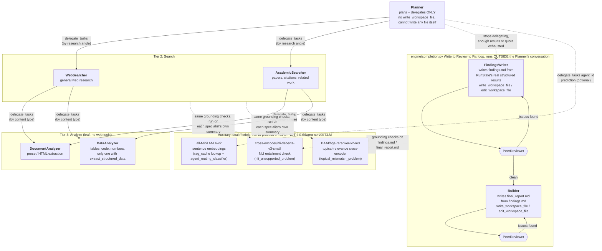

# DeepDelve

A locally-run, multi-agent deep research assistant built on the **Microsoft Agent Framework** and the **Textual** TUI library, targeting local OpenAI-compatible model servers (defaults to **Ollama**, `http://localhost:11434/v1`).

A from-scratch rebuild of an earlier prototype that worked end-to-end but was unreliable beyond simple lookups. This README covers setup and day-to-day use. For depth, see:

- [`ARCHITECTURE.md`](ARCHITECTURE.md): how the completion-check/writer-dispatch engine actually works. Read before touching `src/engine/completion.py` or anything resume-related.
- [`METHODOLOGY.md`](METHODOLOGY.md): why the verification layer is built the way it is, and what's actually novel about it versus prior art.
- [`ROADMAP.md`](ROADMAP.md): what's done, what's open, and the incident history.
- [`MODELS.md`](MODELS.md) / the [wiki's Model Bake off](https://github.com/g0elles/deepdelve/wiki/Model-Bakeoff): the full local-model bake-off, why each candidate failed.

## Architecture


```mermaid
flowchart TD
    Planner["<b>Planner</b><br/>plans + delegates ONLY<br/>no write_workspace_file, cannot write any file itself"]

    subgraph Tier2 ["Tier 2: Search"]
        WebSearcher["<b>WebSearcher</b><br/>general web research"]
        AcademicSearcher["<b>AcademicSearcher</b><br/>papers, citations, related work"]
    end

    subgraph Tier3 ["Tier 3: Analyze (leaf, no web tools)"]
        DocumentAnalyzer["<b>DocumentAnalyzer</b><br/>prose / HTML extraction"]
        DataAnalyzer["<b>DataAnalyzer</b><br/>tables, code, numbers,<br/>only one with extract_structured_data"]
    end

    Planner -- "delegate_tasks<br/>(by research angle)" --> WebSearcher
    Planner -- "delegate_tasks<br/>(by research angle)" --> AcademicSearcher
    WebSearcher -- "delegate_tasks<br/>(by content type)" --> DocumentAnalyzer
    WebSearcher -- "delegate_tasks<br/>(by content type)" --> DataAnalyzer
    AcademicSearcher -- "delegate_tasks<br/>(by content type)" --> DocumentAnalyzer
    AcademicSearcher -- "delegate_tasks<br/>(by content type)" --> DataAnalyzer

    Planner -. "stops delegating,<br/>enough results or quota exhausted" .-> FW

    subgraph WRF ["engine/completion.py Write to Review to Fix loop, runs OUTSIDE the Planner's conversation"]
        direction LR
        FW["<b>FindingsWriter</b><br/>writes findings.md from<br/>RunState's real structured results<br/>write_workspace_file / edit_workspace_file"] --> PR1{{PeerReviewer}}
        PR1 -- issues found --> FW
        PR1 -- clean --> BU["<b>Builder</b><br/>writes final_report.md<br/>from findings.md<br/>write_workspace_file / edit_workspace_file"]
        BU --> PR2{{PeerReviewer}}
        PR2 -- issues found --> BU
    end

    subgraph AUX ["Auxiliary local models, run in-process on CPU, NOT the Ollama-served LLM"]
        direction LR
        NLI["cross-encoder/nli-deberta-v3-small<br/>NLI entailment check<br/>(nli_unsupported_problem)"]
        RERANK["BAAI/bge-reranker-v2-m3<br/>topical-relevance cross-encoder<br/>(topical_mismatch_problem)"]
        EMBED["all-MiniLM-L6-v2<br/>sentence embeddings<br/>(rag_cache lookup + agent_routing_classifier)"]
    end

    WRF -. "grounding checks on<br/>findings.md / final_report.md" .-> NLI
    WRF -. "grounding checks on<br/>findings.md / final_report.md" .-> RERANK
    Tier2 -. "same grounding checks, run on<br/>each specialist's own summary" .-> NLI
    Tier2 -. "same grounding checks, run on<br/>each specialist's own summary" .-> RERANK
    Planner -. "delegate_tasks agent_id<br/>prediction (optional)" .-> EMBED
```

- **Planner**: plans in bounded, named slots (never an open-ended task list), dispatches specialists, and adaptively replans on gaps or contradictions. It has no `write_workspace_file` tool at all, so it structurally cannot write anything itself. Once it stops delegating, its turn ends.
- **FindingsWriter / Builder**: dispatched by the completion-check system, never by the Planner, in a fresh context. FindingsWriter writes `findings.md` from `RunState`'s structured results; Builder writes `final_report.md` from `findings.md`. Each gets a fresh `PeerReviewer` pass and one corrective re-dispatch if flagged.
- **WebSearcher / AcademicSearcher**: search and fetch. Summaries are grounding-checked before they reach the Planner, not just at final-artifact time.
- **DocumentAnalyzer / DataAnalyzer**: read/extract from downloaded files. `DataAnalyzer` alone has `extract_structured_data` for tables/code/JSON.
- **Three auxiliary local models** run in-process on CPU, separate from the Ollama-served LLM: an NLI entailment checker, a topical-relevance reranker, and a sentence embedding model behind the RAG cache and an optional routing classifier. See `ARCHITECTURE.md` §1 for what each check actually catches.

Tool access is withheld from each parent so it's structurally forced to delegate rather than short-circuit the chain. FindingsWriter and Builder exist to keep a retry from growing the Planner's own conversation, see "Context management" below.

## Context management

The Planner's conversation only ever grows across a run (no compaction in the underlying framework). Every completion-check retry used to mean re-showing the model its own prior rejected drafts, risking attention degrading well before any hard token limit, a pattern called "context poisoning." The fix: for an artifact-authoring problem on either artifact, the completion-check system dispatches a fresh-context writer role directly instead of nudging the Planner. Only one genuinely strategic failure (`not_delegated`) still escalates back to the Planner, since only it can decide what to delegate next. `settings.context_budget_chars` is a second, independent guard against a single sub-agent stream growing too large on its own.

## What changed from the prototype

Full history, with live-test evidence for each fix, is in `ROADMAP.md`. The headline structural changes:

- **A layered grounding check** (`utils/grounding.py`) that cross-references every cited URL against what was actually fetched, catches non-URL and stub citations, checks per-claim (not per-line) support, flags cross-source contradictions, and runs an NLI entailment plus topical-relevance pass on top of plain term overlap. Full design and the exact check list live in `ARCHITECTURE.md` §1.
- **The Write → Review → Fix loop** (`ARCHITECTURE.md` §2): a fresh-context `FindingsWriter`/`Builder` writes or rewrites an artifact, a fresh `PeerReviewer` checks it, one corrective re-dispatch if flagged, all outside the Planner's own conversation.
- **Coverage accounting** (`RunState.coverage()`): flags a report that's perfectly grounded yet thin because most of the Planner's own delegated research angles came back empty and got silently dropped.
- **Independent per-dispatch wall-clock deadlines**: every sub-agent dispatch races its own timeout, separate from the run-wide budget, closing a gap where a single runaway generation had nothing watching it.
- **Search-result diversity reranking, fetch-time metadata extraction, real-charset decoding, and full fetch provenance**: smaller reliability fixes that compound into fewer wasted turns and fewer mojibake-broken grounding checks.
- **Detailed tool-call validation errors**: a rejected call surfaces its real reason instead of a bare "Argument parsing failed," the single most common and previously-undiagnosable error signature in real logs.
- **Headless/headed-browser fetch fallback** (optional `playwright` extra): recovers real sources behind a bot wall a plain HTTP client can't reach. Deliberately doesn't attempt to defeat a genuine Cloudflare Turnstile challenge.

## Setup

### 1. Environment

> **NTFS gotcha:** if this project directory is on an NTFS mount (`df -T .` shows `ntfs3`), `python3 -m venv venv` inside the project folder fails since NTFS doesn't support the symlinks venv needs. Create it elsewhere instead:
> ```bash
> python3 -m venv ~/.venvs/deepdelve
> ~/.venvs/deepdelve/bin/python3 -m pip install -e .
> ```

Otherwise:
```bash
python -m venv venv
source venv/bin/activate
pip install -e .
```

**Optional: headless/headed-browser fetch fallback.** Some publishers bot-wall a plain HTTP fetch, so a real, citable paper can come back looking like a fake source. Installing Playwright lets `fetch_url_to_workspace` retry once via Chromium before giving up:
```bash
pip install -e ".[browser]"
playwright install chromium
```
On a display-less Linux server, also install system `Xvfb` so the fallback can try a real (non-headless) browser first, which recovers stricter blocks headless alone can't. Without it, the fallback still works, just headless-only.

### 2. Model & Endpoint

DeepDelve talks to any **OpenAI-compatible chat-completions endpoint**, Ollama is just the default. Point it elsewhere by editing `~/.deepdelve/config.yaml` (created on first run):
```yaml
api:
  openai_base_url: https://api.openai.com/v1   # or any other OpenAI-compatible URL
  openai_model: gpt-4.1                          # or your provider's model name
```
or via environment variables (`OPENAI_API_BASE`, `OPENAI_MODEL`, `OPENAI_API_KEY`), or a separate file via `--config`. The one hard requirement, regardless of provider, is real structured tool-calling support: this agent is 100% tool-call driven, and a model that only narrates JSON as text will not work.

<details>
<summary>Non-default backends: Ollama's native endpoint, and hosted frontier APIs</summary>

**`api.backend: "ollama"`** talks to Ollama's native `/api/chat` instead of its OpenAI-compat `/v1` endpoint. Confirmed live: the OpenAI-compat endpoint leaks a short reasoning field into tool-calling turns even with thinking disabled, while the native endpoint suppresses it cleanly for the same request. Only meaningful when actually running against Ollama. Full detail and a known landmine (Qwen3.5/3.6-family models need an explicit `PARSER`/`RENDERER` declaration on this path) in `ARCHITECTURE.md` §7.

**`api.backend: "openai_hosted"`** is for a real hosted frontier API (DeepSeek, etc.) rather than local serving. The default backend's thinking-mode control is a local-serving convention a hosted API silently ignores; this backend looks up each provider's own documented toggle instead.

</details>

The rest of this section covers the **Ollama default** and its gotchas. Skip it if you're pointing at a different provider.

Default model: `deepdelve-gpt-oss` (a `gpt-oss:20b` derived tag). Two things that will silently break tool-calling if skipped:

> **Tool-call support:** if a model never emits a structured `tool_calls` response, every agent just narrates instead of acting. Official Ollama library models ship with a verified parser; `hf.co/...` GGUF imports often don't. Verify with:
> ```bash
> curl -s http://localhost:11434/v1/chat/completions -H "Content-Type: application/json" -d '{
>   "model": "<your-model>",
>   "messages": [{"role": "user", "content": "Search the web for the population of Tokyo."}],
>   "tools": [{"type": "function", "function": {"name": "web_search", "description": "Search the web.", "parameters": {"type": "object", "properties": {"query": {"type": "string"}}, "required": ["query"]}}}]
> }' | python3 -c "import json,sys; print(json.load(sys.stdin)['choices'][0]['message'].get('tool_calls'))"
> ```
> A working model prints a populated list; a broken one prints `None`.

> **Context window:** Ollama-library models default to `num_ctx: 4096`, too small here. Create a derived tag with headroom:
> ```bash
> ollama pull gpt-oss:20b
> cat > Modelfile << 'EOF'
> FROM gpt-oss:20b
> PARAMETER num_ctx 16384
> EOF
> ollama create deepdelve-gpt-oss -f Modelfile
> ```
> Also set `OLLAMA_NUM_PARALLEL=1` in `/etc/systemd/system/ollama.service.d/override.conf` and restart, otherwise Ollama silently divides `num_ctx` across parallel request slots.

**Model choice**: `deepdelve-gpt-oss` (`gpt-oss:20b`) is the only local candidate with a full pass across two live benchmarks, out of the many candidates tried. Passing an isolated tool-call schema test is not sufficient evidence a model behaves reliably in the real multi-agent role, every candidate was run through the actual Planner/Searcher/Writer roles. Full per-candidate detail lives in [`MODELS.md`](MODELS.md) and the wiki's [Model Bake off](https://github.com/g0elles/deepdelve/wiki/Model-Bakeoff). **The meta-result holds across every run and model regardless: no fabricated report has ever gotten past the grounding gates unlabeled.** The defense layer is the validated product; model quality only determines how often it has to fire.

### 3. Run

```bash
python src/app.py                                        # TUI
python src/app.py --prompt "..." --auto-approve          # headless
python src/app.py --prompt "..." --depth deep            # quota/search/retry presets: quick|standard|deep
python src/app.py --prompt "..." --style academic        # literature-review paper shape + (Author, Year) citations
python src/app.py --prompt "..." --seed-url https://...  # pre-fetch known-good sources (repeatable)
python src/app.py --prompt "..." --seed-doc ./notes.pdf  # load a local file (PDF/DOCX/XLSX/PPTX/txt/md) into the run (repeatable)
python src/app.py --resume-run <run_folder>              # reattach an interrupted run, fresh budget
python src/app.py --list-runs                            # workspace runs + report status
```

Headless runs are honest about failure: a pre-run health probe aborts in seconds instead of burning a doomed 20-minute run, a crashed run still saves forensics, and every run ends with a finish-line summary. `_run_state.json` is written from run start and updated on every event, so even a killed run leaves a scoreable record. `settings.max_run_minutes` (default 45) cuts a runaway run at the turn boundary with an explicit outcome, not a hard kill.

In the TUI, the first message gets a one-shot intake check (the model either proceeds or asks up to 3 scoping questions, fail-open; headless runs never ask). Follow-ups in the same conversation reuse the run's fetched-URL state; once a report exists, follow-ups skip the completion check (Q&A mode).

Every run's output folder gets, alongside `final_report.md`: `references.bib` (BibTeX, one entry per URL the report actually cites), always generated once the report cites a real source, and optionally `final_report.pdf` if `settings.pdf_engine` is set.

### 4. Optional: HTTP API + web UI

`src/api.py` (FastAPI) is an alternative surface to the TUI/CLI, a local HTTP server plus a minimal web UI (`src/static/index.html`) for submitting queries, browsing past runs with resume, asking follow-ups, and editing settings from a browser. Not installed by default:

```bash
pip install -e ".[api]"
deepdelve-api                          # binds 127.0.0.1:8420 by default
deepdelve-api --host 0.0.0.0 --port 8420 --i-understand-the-risk   # LAN/phone access
```

Three tabs: **Research** (submit, watch a per-agent timeline, cancel, view the rendered report, ask follow-ups), **Runs** (accurate status per run, sourced from live job state, not just file presence), **Settings** (your live config as an editable form, secrets masked). Endpoints for scripting: `POST /research`, `GET /research/{id}/status|stream|report|bib|pdf`, `POST /research/{id}/resume|followup|cancel`, `GET /runs`, `GET /active`, `GET`/`POST /settings`.

**Concurrency**: one research run at a time, process-wide. The engine's session state is module-level, not per-request-safe, so the API queues rather than risks cross-run corruption. **Security**: no auth by default, matching the TUI/CLI's local-single-user posture; binding non-loopback requires `--i-understand-the-risk`. Set `settings.api_password` before exposing it beyond localhost, the settings editor can read and write your full config, API keys included.

## Config highlights (`config_template.yaml`)

- `settings.quotas` / `settings.retry_quota_topup`: global, cumulative tool-call budgets, with extra headroom on a completion-check retry.
- `settings.grounding_check`: toggles for each grounding layer (NLI entailment, topical relevance, stub detection, regulation IDs, etc.), see the file's own comments for the full list.
- `settings.coverage_check`: flags a report whose delegated research plan came back mostly empty, even if what got written is fully grounded.
- `settings.sub_agent_timeout_minutes` (default 10): independent per-dispatch wall-clock ceiling. Not back-filled automatically into an existing config, add it by hand if upgrading.
- `settings.max_run_minutes` / `settings.max_completion_check_attempts`: run-level wall-clock and retry-cycle budgets.
- `settings.context_budget_chars` (default 50000): per-agent-stream character budget guarding against silent top-of-context truncation.
- `settings.search_mode: heavy`: search deeper and auto-fetch more top results per call.
- `settings.search_backend`: `auto` rotates across ddgs's engines; a pinned single engine is a single point of failure.
- `settings.concurrency.max_concurrent_tasks`: how many sub-agent dispatches run in parallel per batch.
- `settings.report_style` (`standard`/`academic`/`answer`, also `--style`): report shape, orthogonal to `--depth`.
- `settings.human_in_the_loop`: require approval on the Planner's plan before research proceeds.
- `settings.permissions`: per-tool approval gate, defaults to gating `remove_workspace_file`.
- `settings.enable_conversational_memory` / `settings.enable_session_persistence`: follow-up context reuse and restart survival.
- `settings.mcp_servers`: wire in external MCP tools, scoped per sub-agent.
- `settings.pdf_engine`: off by default; `"weasyprint"` or a real LaTeX engine to also produce `final_report.pdf` (needs the `pandoc` system binary either way).
- `settings.api_password`: only relevant if exposing `src/api.py` beyond localhost.
- `settings.specialist_model`: optional second, smaller model for leaf specialist roles only. A live A/B on this project's own hardware found this 4.2x slower and lower-quality than a single model, kept as an option for different hardware where two models can coexist without reload thrashing. Full trial history in `ROADMAP.md`'s bake-off log.

## Eval Harness

`eval/` is a headless-run + score harness. `dataset.jsonl` ships with 4 items: a simple factual lookup, a comparative query, a paper-plus-related-work academic query, and a niche-research query used for a larger weighted-rubric benchmark (`eval/colombia_b2b_benchmark.md`).

```bash
python eval/evaluate.py --runs 3
python eval/results_viewer.py
```

## References

DeepDelve's own model bake-off isn't an idiosyncratic gap. A published capacity-floor study found `qwen2.5:14b` as the "minimum viable production" threshold for reliable tool invocation, and MAST's 14-mode failure taxonomy (Cemri et al., NeurIPS 2025) maps closely onto DeepDelve's own documented bug catalog. These are known, published agent-failure patterns, not project-specific quirks.

Full literature review and bibliography: **[Literature Review](https://github.com/g0elles/deepdelve/wiki/Literature-Review)** · **[References](https://github.com/g0elles/deepdelve/wiki/References)**
